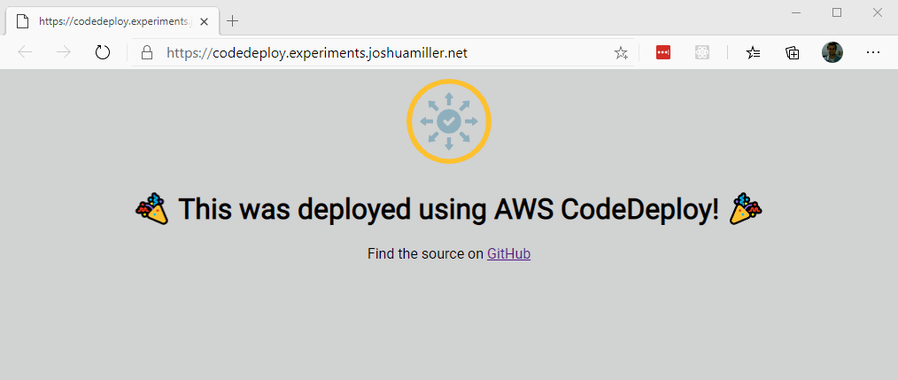

<div align="center">

# AWS Code Deploy - Full Sample

*If the badge immediately following this text is green, then the infrastructure and app have been destroyed*

[](https://dev.azure.com/JoshuaTheMiller/PublicExamples/_build?definitionId=3)

*The following badges may be invalid, as I typically tear down resources after I am done with them. The first is the app build, the second links to the site (only valid if badge above is NOT green)*

[]((https://dev.azure.com/JoshuaTheMiller/PublicExamples/_build/latest?definitionId=2&branchName=main)) [][loadBalancerLink]

</div>



## Development

### Terraform

I have committed my backend config which uses Terraform Cloud, please delete it if you do not wish to use Terraform Cloud.

```sh
cd infrastructure
terraform plan -out now.tfplan
terraform apply now.tfplan
```

### Scripts I found useful for some reason

```sh
ssh -i "deployer-one.pem" ubuntu@<EC2InstanceDNS>
```

```sh
sudo apt-get update -y && sudo apt-get install nodejs -y && curl -o server.js https://gist.githubusercontent.com/JoshuaTheMiller/5ffbe44400922abceba1e4f1bfc657cb/raw/2f735081d9ad24e6b6ef57e46f02ce1f5ff795dc/server.js && node server.js
```

## Gotchyas

### TF Planning during Deployment

If `terraform plan` is ran during a Deployment that is able to deregister EC2 instances from a Load Balancer, Terraform will think a connection is missing, and will plan for it to be recreated. Doing this will disrupt the deployment process, and it could cause unintended side effects (such as causing traffic to be routed to a bad EC2 instance).

```sh
+ create

Terraform will perform the following actions:

# aws_lb_target_group_attachment.group[1] will be created
+ resource "aws_lb_target_group_attachment" "group" {
    + id               = (known after apply)
    + port             = 80
    + target_group_arn = "arn:aws:elasticloadbalancing:us-east-1:216040693275:targetgroup/tf-example-lb-tg/3de1e6856393cd67"
    + target_id        = "i-00b76a890af6185ac"
}

Plan: 1 to add, 0 to change, 0 to destroy.
```

### Deployments taking forever?

If deployment seems to be stuck on BlockTraffic, it may be due to a behavior designed to save the user experience- deregistration delays:

> ## Deregistration delay
>
> Elastic Load Balancing stops sending requests to targets that are deregistering. By default, Elastic Load Balancing waits 300 seconds before completing the deregistration process,  which can help in-flight requests to the target to complete. To change the amount of time that Elastic Load Balancing waits, update the deregistration delay value.
>
> The initial state of a deregistering target is draining. After the deregistration delay elapses, the deregistration process completes and the state of the target is unused. If the target is part of an Auto Scaling group, it can be terminated and replaced.
> 
> If a deregistering target has no in-flight requests and no active connections, Elastic Load Balancing immediately completes the deregistration process, without waiting for the deregistration delay to elapse. However, even though target deregistration is complete, the status of the target will be displayed as draining until the deregistration delay elapses.
> 
> If a deregistering target terminates the connection before the deregistration delay elapses, the client receives a 500-level error response.

## Sources

* Public EC2 instances in a subnet: https://hands-on.cloud/terraform-recipe-managing-aws-vpc-creating-public-subnet/
* Hooks Reference: https://docs.aws.amazon.com/codedeploy/latest/userguide/reference-appspec-file-structure-hooks.html#appspec-hooks-server
* When do Files get copied in AppSpec (during Install): https://docs.aws.amazon.com/codedeploy/latest/userguide/reference-appspec-file-structure-files.html
* The only course you'll need: https://app.pluralsight.com/library/courses/deploying-code-aws-codedeploy

 


[loadBalancerLink]: https://codedeploy.experiments.joshuamiller.net/